# HomeHorizon 🏡

HomeHorizon is a comprehensive **real estate platform** built with React and Node.js that connects property buyers, sellers, and real estate agents in one dynamic marketplace. The platform allows users to browse properties, make offers, manage listings, get expert guidance from agents, and connect with fellow property enthusiasts. With features like role-based authentication, advanced property management, payment integration, and interactive community features, HomeHorizon makes real estate transactions seamless and efficient.

## 🚀 Live Demo

A live demo of the project can be found [here on Netlify](https://homehorizon-by-rakib.netlify.app) & [here on Surge](http://HOMEHORIZON-by-rakib.surge.sh).

---

## 📸 Screenshots

To know better about our project:

| Page | Screenshot |
|------|------------|
| **Home Page** | 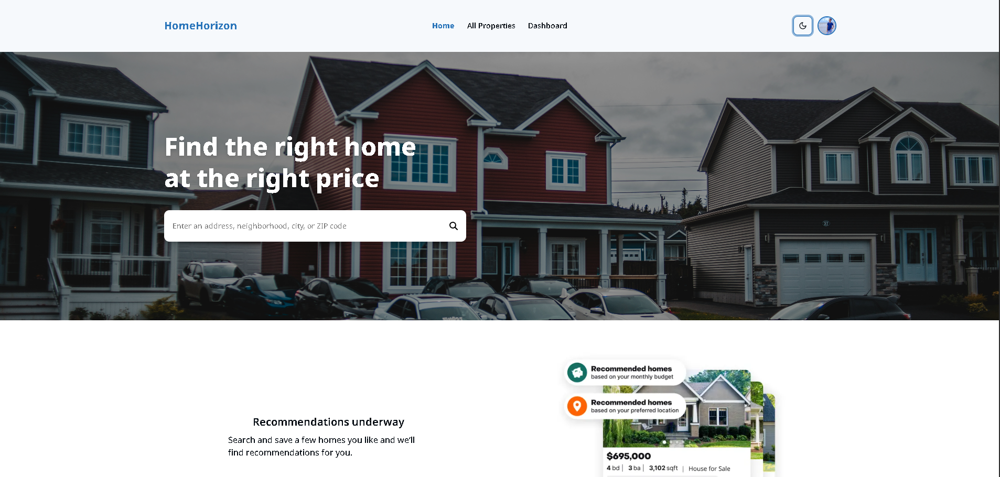 |
| **All Properties Page** | 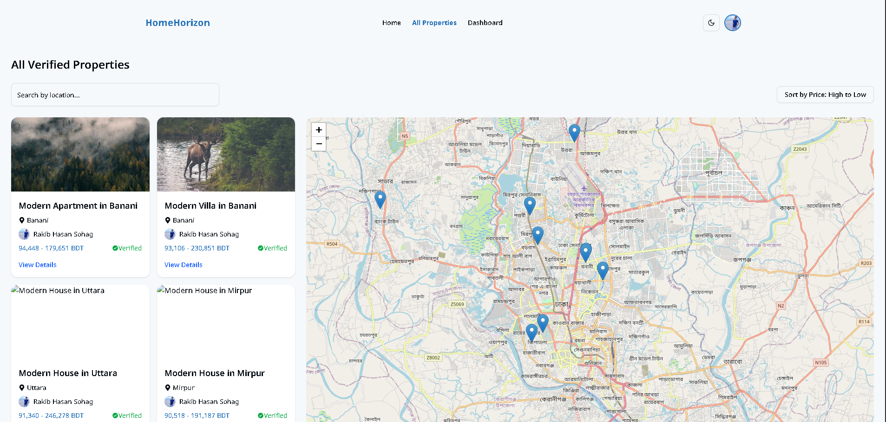 |
| **Property Details Page** | 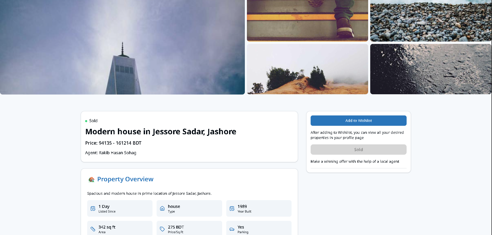 |
| **Login Page** | 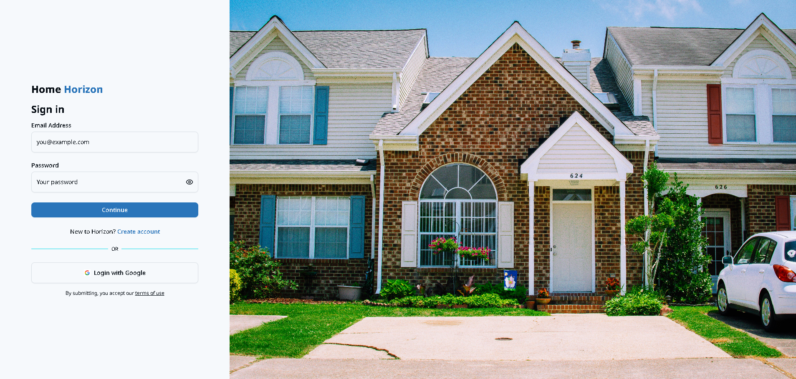 |
| **Register Page** | 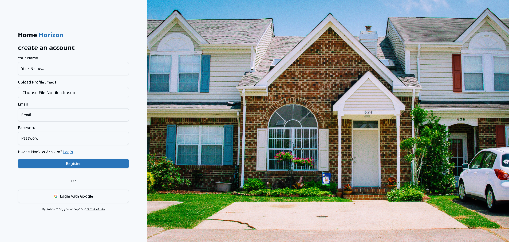 |
| **Dashboard Home** |  |
| **Add Property Page** | 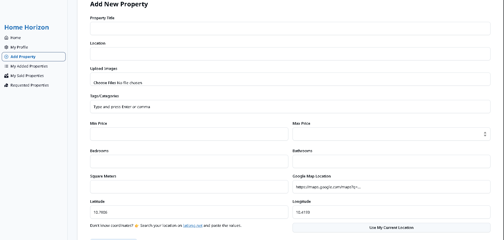 |
| **My Properties Page** | 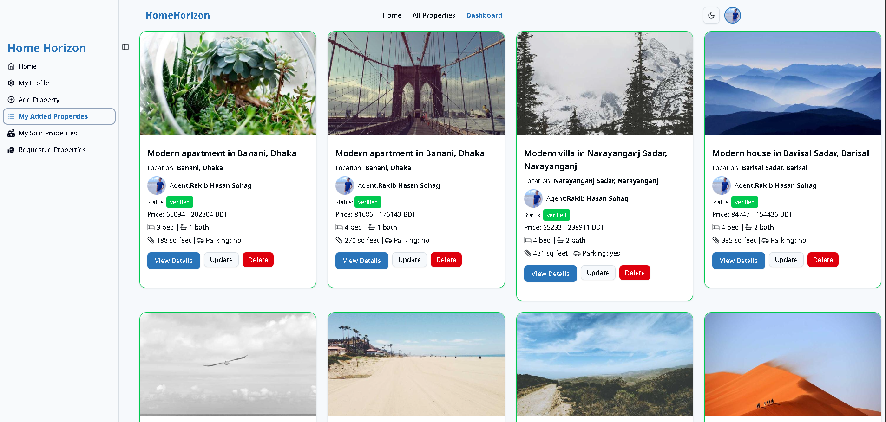 |
| **Profile Page** | 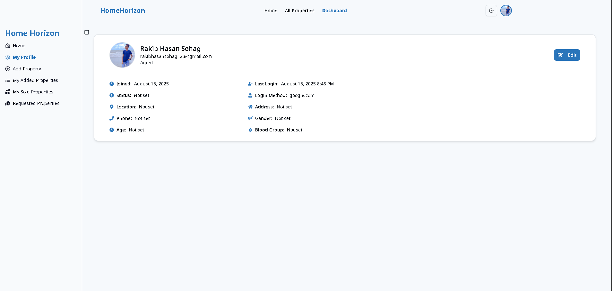 |
| **My Wishlist Page** | 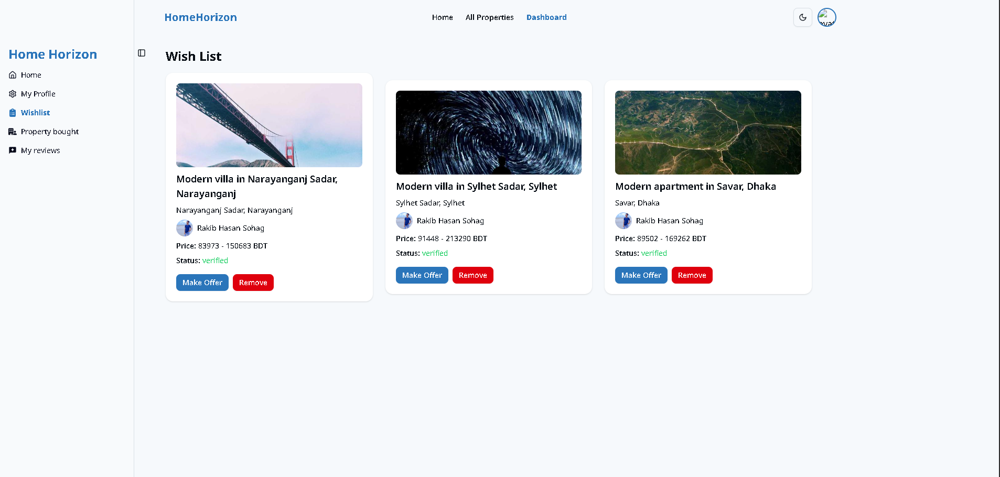 |
| **Make Offer Page** | 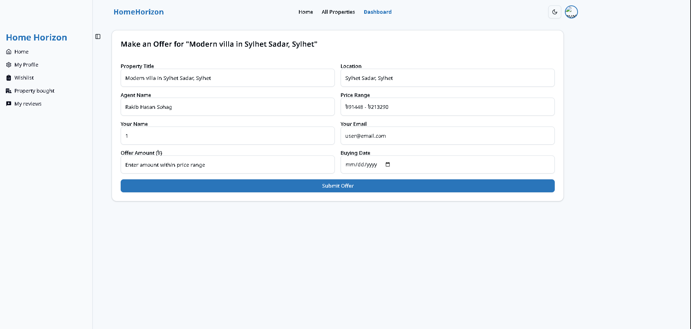 |
| **Property Bought Page** | 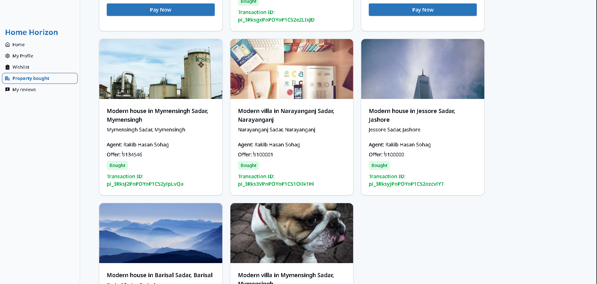 |
| **My Reviews Page** | 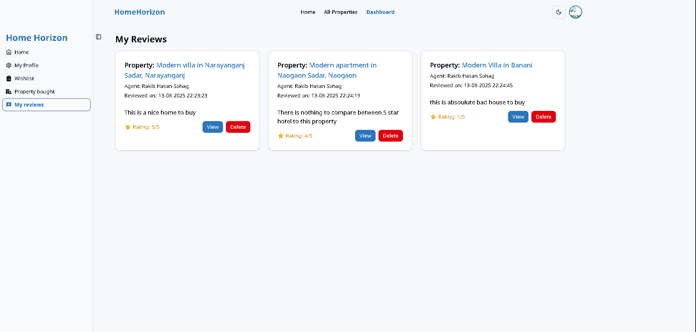 |
| **Requested Property Page** | 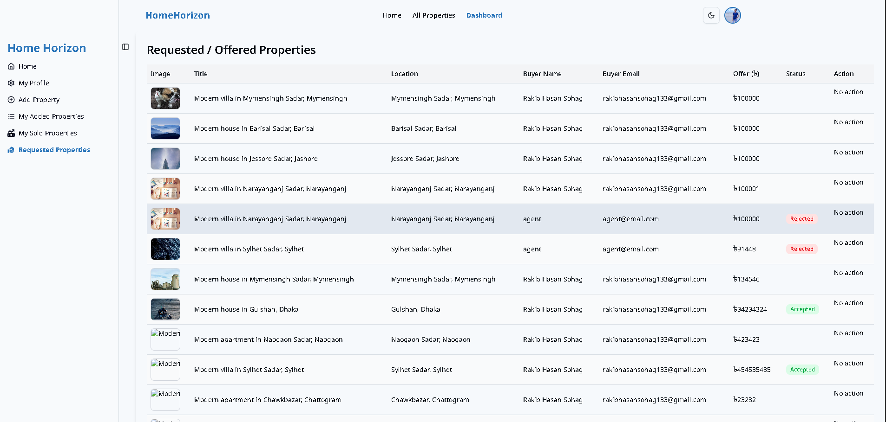 |
| **Agent Sold Properties** | 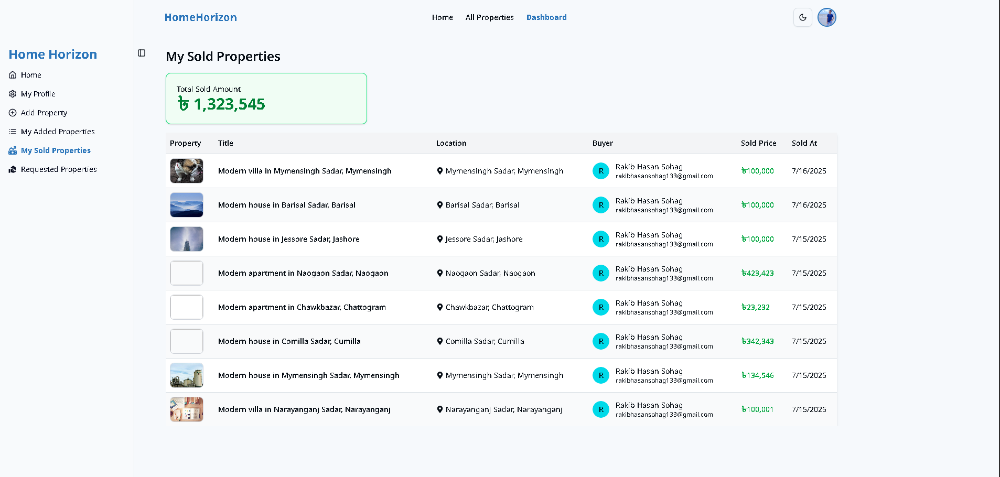 |
| **Admin Manage Properties** | 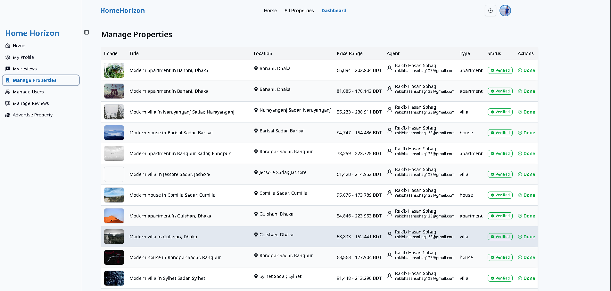 |
| **Admin Manage Users** | 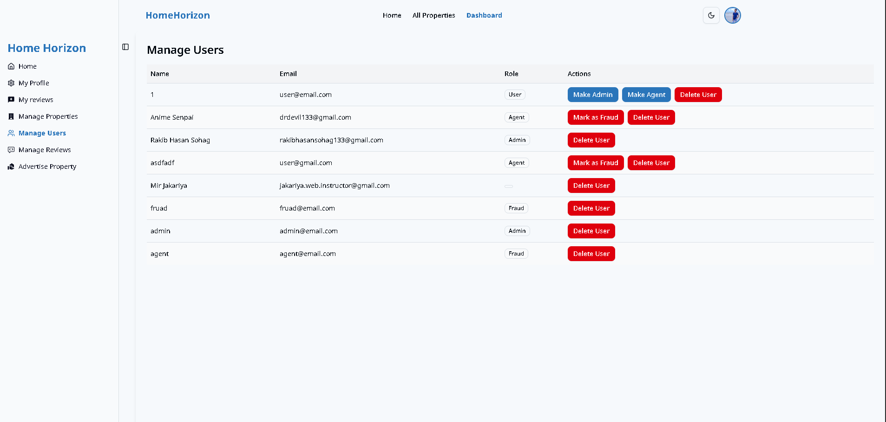 |
| **Admin Manage Reviews** | 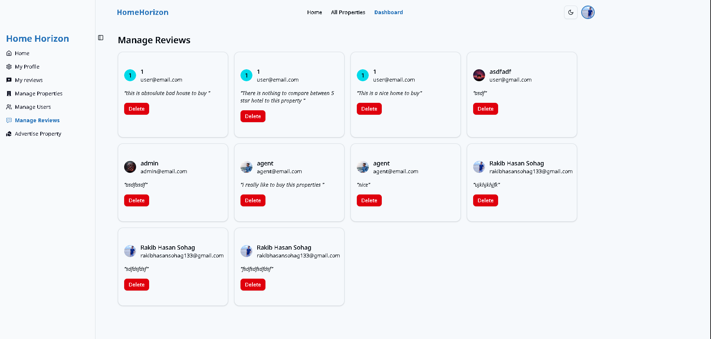 |
| **Admin Advertise Property** | 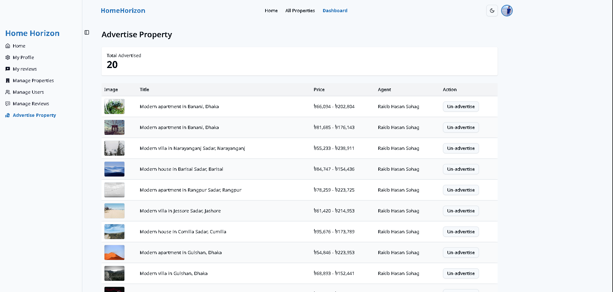 |
| **Payment Page** |  |
| **Forbidden Page** | 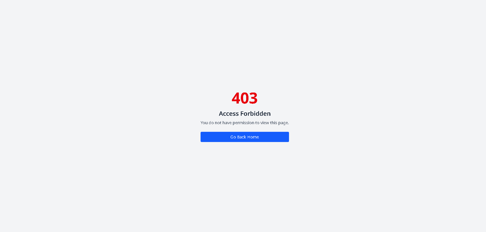 |
| **Not Found Page** |  |

---

## ✨ Features

### 🏠 **Property Management**
* **Browse Properties**: Explore a vast collection of residential and commercial properties.
* **Advanced Search & Filter**: Find specific properties with powerful search and filtering options.
* **Property Details**: Detailed property information with images, location maps, and specifications.
* **Add Properties**: Agents can list new properties with comprehensive details and images.

### 👥 **User Roles & Authentication**
* **Three User Roles**: User (Buyer), Agent (Seller), and Admin (Platform Manager).
* **Firebase Authentication**: Secure authentication with email/password and social login options.
* **Role-Based Access Control**: Different dashboard features based on user roles.
* **Protected Routes**: Secure user areas for profile management and transactions.

### 💼 **Agent Features**
* **Property Listings**: Manage and update property listings.
* **Offer Management**: Handle purchase offers from potential buyers.
* **Sales Tracking**: Track sold properties and commission details.
* **Performance Analytics**: View sales performance and statistics.

### 🛡️ **Admin Features**
* **User Management**: Manage all users, agents, and their roles.
* **Property Moderation**: Approve, reject, or remove property listings.
* **Review Management**: Moderate user reviews and ratings.
* **Property Advertisement**: Feature properties on the homepage.

### 💰 **Transaction Features**
* **Make Offers**: Users can make offers on properties.
* **Payment Integration**: Secure payment processing with Stripe.
* **Wishlist**: Save favorite properties for future reference.
* **Purchase History**: Track bought properties and transaction history.

### 🎨 **User Experience**
* **Modern UI/UX**: Clean, intuitive interface built with Tailwind CSS and Radix UI.
* **Interactive Maps**: Property location visualization with Leaflet maps.
* **Smooth Animations**: Beautiful transitions and interactions powered by Motion.
* **Mobile Responsive**: Fully responsive design that works seamlessly on all devices.
* **Real-time Updates**: Dynamic content updates and notifications.

---

## 🛠️ Tech Stack

### Frontend
* **React 19** – Modern UI library with latest features
* **React Router 7** – Advanced client-side routing
* **Tailwind CSS 4** – Utility-first CSS framework
* **Radix UI** – Accessible component primitives
* **Motion** – Powerful animation library
* **Firebase Auth** – Secure authentication system
* **Vite** – Lightning-fast build tool
* **TanStack React Query** – Server state management
* **React Hook Form** – Performant forms with easy validation
* **Leaflet & React Leaflet** – Interactive maps
* **Axios** – HTTP client for API requests
* **Stripe** – Payment processing integration
* **Lottie React** – High-quality animations
* **React Icons** – Comprehensive icon library
* **Moment.js** – Date and time formatting

### Backend
* **Node.js** – JavaScript runtime environment
* **Express.js** – Fast web application framework
* **MongoDB** – NoSQL database for flexible data storage
* **Firebase Admin SDK** – Server-side Firebase integration
* **JWT** – JSON Web Token for authentication
* **Stripe** – Payment processing
* **Cloudinary** – Image upload and management
* **Multer** – File upload handling
* **CORS** – Cross-origin resource sharing
* **dotenv** – Environment variable management

---

## 🔐 Test Credentials

| Role | Email | Password |
|------|--------|----------|
| **Admin** | admin@email.com | Password123@ |
| **Agent** | agent@email.com | Password123 |
| **Fraud Agent** | fraud@email.com | Password123 |

---

## 📦 Installation

### Prerequisites
* Node.js (v18 or higher)
* npm or yarn
* MongoDB database
* Firebase project
* Stripe account
* Cloudinary account

### Clone the Repository
```bash
git clone https://github.com/rakibhasansohag/home-horizon.git
cd home-horizon
```

### Client Setup

1. **Navigate to client directory**:
   ```bash
   cd client
   ```

2. **Install dependencies**:
   ```bash
   npm install
   ```

3. **Set up environment variables**:
   Create a `.env` file in the client directory:
   ```env
   VITE_FIREBASE_API_KEY=your_firebase_api_key
   VITE_FIREBASE_AUTH_DOMAIN=your_project_id.firebaseapp.com
   VITE_FIREBASE_PROJECT_ID=your_project_id
   VITE_FIREBASE_STORAGE_BUCKET=your_project_id.appspot.com
   VITE_FIREBASE_MESSAGING_SENDER_ID=your_messaging_sender_id
   VITE_FIREBASE_APP_ID=your_app_id
   VITE_API_URL=http://localhost:5000
   VITE_STRIPE_PUBLISHABLE_KEY=your_stripe_publishable_key
   ```

4. **Start the development server**:
   ```bash
   npm run dev
   ```

### Server Setup

1. **Navigate to server directory**:
   ```bash
   cd server
   ```

2. **Install dependencies**:
   ```bash
   npm install
   ```

3. **Set up environment variables**:
   Create a `.env` file in the server directory:
   ```env
   PORT=5000
   MONGODB_URI=your_mongodb_connection_string
   JWT_SECRET=your_jwt_secret
   FIREBASE_SERVICE_ACCOUNT_KEY=path_to_your_firebase_service_account_key.json
   STRIPE_SECRET_KEY=your_stripe_secret_key
   CLOUDINARY_CLOUD_NAME=your_cloudinary_cloud_name
   CLOUDINARY_API_KEY=your_cloudinary_api_key
   CLOUDINARY_API_SECRET=your_cloudinary_api_secret
   NODE_ENV=development
   ```

4. **Start the server**:
   ```bash
   npm run dev
   ```

Your client app should be running at `http://localhost:5173` and your server at `http://localhost:5000`.

---

## 🚀 Deployment

### Client Deployment

**Netlify**:
1. Push your code to GitHub
2. Connect your repo to Netlify
3. Set build command: `npm run build`
4. Set publish directory: `dist`
5. Add environment variables in Netlify's dashboard

**Surge**:
1. Install Surge globally: `npm install -g surge`
2. Build the app: `npm run build`
3. Deploy: `surge ./dist`

### Server Deployment
Deploy your Node.js server to platforms like Railway, Render, or Vercel, ensuring all environment variables are properly configured.

---

## 📁 Project Structure

### Monorepo Structure
```
home-horizon/
├── client/                     # Frontend React application
│   ├── public/                 # Static assets and screenshots
│   ├── src/
│   │   ├── components/         # Reusable UI components
│   │   │   ├── Shared/         # Shared components
│   │   │   │   ├── Navbar/     # Navigation components
│   │   │   │   ├── Footer/     # Footer components
│   │   │   │   └── NotFound/   # Error page components
│   │   │   ├── ui/             # Radix UI components
│   │   │   └── ...             # Other components
│   │   ├── layouts/            # Layout components
│   │   │   ├── HomeLayout.jsx  # Main site layout
│   │   │   ├── AuthLayout.jsx  # Authentication layout
│   │   │   └── DashboardLayout.jsx # Dashboard layout
│   │   ├── pages/              # Page components
│   │   │   ├── Authentication/ # Login/Register pages
│   │   │   ├── Dashboard/      # Dashboard pages
│   │   │   ├── Home.jsx        # Homepage
│   │   │   ├── AllProperties.jsx # Properties listing
│   │   │   └── PropertyDetails.jsx # Property details
│   │   ├── hooks/              # Custom React hooks
│   │   ├── contexts/           # React contexts
│   │   ├── utils/              # Utility functions
│   │   ├── services/           # API services
│   │   ├── route/              # Route protection components
│   │   ├── App.jsx             # Main app component
│   │   └── main.jsx            # Entry point
│   ├── package.json
│   └── vite.config.js
├── server/                     # Backend Node.js application
│   ├── models/                 # Database models
│   ├── routes/                 # API routes
│   ├── middleware/             # Express middleware
│   ├── controllers/            # Route controllers
│   ├── utils/                  # Utility functions
│   ├── config/                 # Configuration files
│   ├── index.js                # Main server file
│   └── package.json
├── .gitignore
└── README.md
```

---

## 🔗 Links

| Platform | Link |
|----------|------|
| **Live Demo (Netlify)** | [https://homehorizon-by-rakib.netlify.app](https://homehorizon-by-rakib.netlify.app) |
| **Live Demo (Surge)** | [http://HOMEHORIZON-by-rakib.surge.sh](http://HOMEHORIZON-by-rakib.surge.sh) |
| **GitHub Repository** | [https://github.com/rakibhasansohag/home-horizon](https://github.com/rakibhasansohag/home-horizon) |
| **Client Side Code** | [https://github.com/Programming-Hero-Web-Course4/b11a12-client-side-rakibhasansohag](https://github.com/Programming-Hero-Web-Course4/b11a12-client-side-rakibhasansohag) |
| **Server Side Code** | [https://github.com/Programming-Hero-Web-Course4/b11a12-server-side-rakibhasansohag](https://github.com/Programming-Hero-Web-Course4/b11a12-server-side-rakibhasansohag) |

---

## 📱 Key Pages & Routes

### Public Routes
* `/` - Homepage with featured properties
* `/all-properties` - Browse all available properties
* `/all-properties/:id` - Individual property details (login required)
* `/auth/login` - User login
* `/auth/register` - User registration

### Protected Dashboard Routes
* `/dashboard` - Dashboard homepage
* `/dashboard/profile` - User profile management
* `/dashboard/wishlist` - User's saved properties
* `/dashboard/offer/:propertyId` - Make an offer on a property
* `/dashboard/property-bought` - User's purchased properties
* `/dashboard/my-reviews` - User's reviews and ratings

### Agent Only Routes
* `/dashboard/add-property` - Add new property listing
* `/dashboard/my-property` - Manage agent's properties
* `/dashboard/agent-offer-properties` - Handle incoming offers
* `/dashboard/sold-properties` - View sold properties

### Admin Only Routes
* `/dashboard/manage-properties` - Moderate all properties
* `/dashboard/manage-users` - User and role management
* `/dashboard/manage-reviews` - Review moderation
* `/dashboard/advertise-property` - Feature properties

---

## 🤝 Contributing

Contributions are welcome! Please follow these steps:

1. Fork the repository
2. Create a feature branch (`git checkout -b feature/amazing-feature`)
3. Commit your changes (`git commit -m 'Add some amazing feature'`)
4. Push to the branch (`git push origin feature/amazing-feature`)
5. Open a Pull Request

---

## 👨‍💻 Author

**Rakib Hasan Sohag**
- GitHub: [@rakibhasansohag](https://github.com/rakibhasansohag)
- Email: rakibhasansohag@gmail.com

---

## 📄 License

This project is licensed under the MIT License - see the [LICENSE](LICENSE) file for details.

---

*HomeHorizon - Making real estate transactions seamless and efficient for everyone.*
